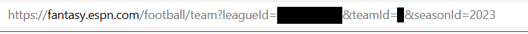

# ESPN Fantasy Football Client

An ESPN Fantasy Football client library and daemon.

## Daemon

### Requirements

- Make
- Go
- ESPN Fantasy Football Account

### Getting your league ID, ESPN_S2 token, and SWID

1. Navigate to the [ESPN Fantasy Home](https://www.espn.com/fantasy/)
2. Click on your team/league 
3. Copy the `leagueId` from the URL 
4. Open your browser's developer tools
5. Open the `Network` tab
6. Reload the page
7. Click on the first request
8. Select the `Cookies` tab on the right-hand side
9. Copy the `espn_s2` cookie value to ~somewhere~
10. Copy the `SWID` cookie value to ~somewhere~


### Make and run the daemon

```bash
$ make daemon
$ ./bin/espnffd -league <league_id> -espns2 <espn_s2> -swid <swid>
```
